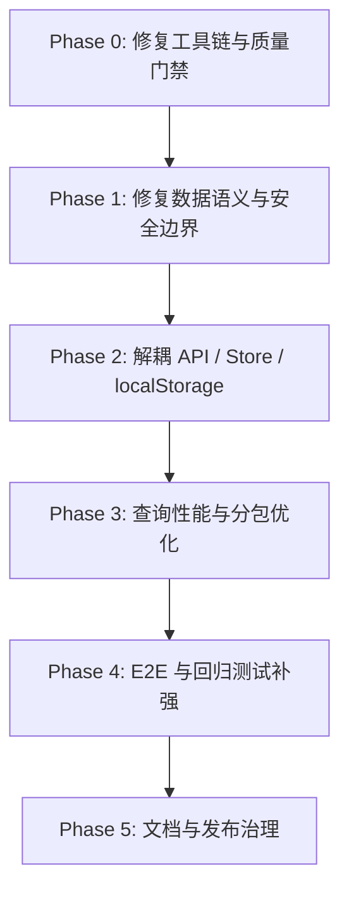
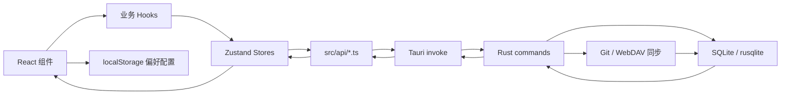

# 滴答清单复刻项目架构优化可执行操作文档

> 项目路径：`C:\Users\50441\Documents\trae开发\滴答清单复刻`  
> 文档日期：2026-07-07  
> 适用对象：后续开发人员、架构优化执行者、AI 编码代理  
> 执行原则：先修复工具链与质量门禁，再做安全、数据语义、状态层、性能和测试体系优化。

---

## 0. 快速结论

当前项目已经具备较完整的滴答清单复刻功能：任务、清单、标签、日历、习惯、番茄钟、目标、模板、AI、Git/WebDAV 同步等模块均已存在。整体架构为 **Tauri v2 + React 18 + TypeScript + Zustand + SQLite/Rust**。

但项目目前存在 4 类主要架构风险：

1. **质量门禁不稳定**：前端测试链路、ESLint、Prettier、CI 配置存在不一致或不可运行问题。
2. **构建与仓库污染**：部分生成文件被 Git 追踪，构建会改写工作区。
3. **安全边界过宽**：Tauri 文件读写权限过大，LLM API Key 与 WebDAV 密码存在明文存储风险。
4. **可维护性和扩展性不足**：Store 之间存在耦合，任务更新语义不清，查询和 E2E 测试体系还需增强。

推荐执行顺序：



---

## 1. 项目现状总结

### 1.1 技术栈概览

| 层级     | 当前实现                                          |
| -------- | ------------------------------------------------- |
| 桌面壳   | Tauri v2                                          |
| 前端框架 | React 18 + TypeScript                             |
| 构建工具 | Vite                                              |
| 样式     | Tailwind CSS + CSS 变量主题                       |
| 状态管理 | Zustand                                           |
| 后端     | Rust + Tauri commands                             |
| 数据库   | SQLite / rusqlite，已开启 WAL                     |
| 同步     | Git 同步 + WebDAV 同步                            |
| AI       | OpenAI-compatible LLM API，本地配置，支持流式对话 |
| 测试     | Vitest、Playwright、Rust 单元测试                 |
| CI       | GitHub Actions                                    |

### 1.2 当前代码规模

| 类型          |         数量 |
| ------------- | -----------: |
| 前端源码文件  |       217 个 |
| 前端源码行数  | 约 27,441 行 |
| Rust 源码文件 |        34 个 |
| Rust 源码行数 |  约 5,155 行 |
| 前端单测代码  |  约 3,230 行 |
| E2E 测试代码  |     约 35 行 |

### 1.3 当前主数据流



### 1.4 主要目录说明

| 路径                       | 职责                                                          |
| -------------------------- | ------------------------------------------------------------- |
| `src/components`           | 任务列表、详情、日历、AI、设置、习惯、番茄钟、目标、模板等 UI |
| `src/hooks`                | 任务 CRUD、批量操作、拖拽、快捷键、初始化、筛选               |
| `src/stores`               | Zustand 状态层                                                |
| `src/api`                  | 前端 Tauri command 封装                                       |
| `src/utils`                | 日期、提醒、搜索、主题、LLM、通知、错误日志等工具函数         |
| `src-tauri/src/commands`   | Rust command 层                                               |
| `src-tauri/src/db.rs`      | SQLite schema 初始化与迁移                                    |
| `tests`                    | Playwright E2E 测试                                           |
| `.github/workflows/ci.yml` | CI 配置                                                       |

### 1.5 当前优点

| 优点                    | 说明                                                                     |
| ----------------------- | ------------------------------------------------------------------------ |
| 功能覆盖较完整          | 已具备任务、清单、标签、日历、习惯、番茄钟、目标、模板、AI、同步等模块。 |
| 已有模块化基础          | 前端已拆出 `api`、`hooks`、`stores`、多个子组件。                        |
| TypeScript 严格模式开启 | `tsconfig.json` 启用了 `strict`、`noUnusedLocals` 等规则。               |
| Rust 后端分层清晰       | command 按任务、清单、标签、同步、习惯、模板等拆分。                     |
| SQLite 基础优化已做     | 已启用 WAL，并为任务、标签、习惯、报告等建立索引。                       |
| 生产构建可通过          | `npm.cmd run build` 当前可通过。                                         |
| Rust 测试可通过         | `cargo test` 当前可通过。                                                |

---

## 2. 核心问题清单

| 优先级 | 问题                                | 证据 / 位置                                                                                                 | 影响                                             |
| ------ | ----------------------------------- | ----------------------------------------------------------------------------------------------------------- | ------------------------------------------------ |
| P0     | 前端测试链路不可用                  | `npm.cmd run test` 报 `ERR_PACKAGE_PATH_NOT_EXPORTED`，当前 `vitest@4.1.9` 与 `vite@5.4.21` 不匹配          | 单测无法提供回归保护，重构风险高                 |
| P0     | CI 配置与项目依赖不一致             | `.github/workflows/ci.yml` 执行 `npx eslint .`、`npx prettier --check .`，但项目无稳定 ESLint/Prettier 配置 | CI 结果不可控                                    |
| P0     | 生成文件被追踪且构建会改写          | `vite.config.js`、`vite.config.d.ts`、`playwright-report/index.html` 被 Git 追踪                            | 构建污染工作区，容易误提交无关 diff              |
| P1     | Tauri 文件权限过宽                  | `src-tauri/capabilities/default.json` 允许 `fs` 读写 `**`                                                   | 桌面安全边界过大                                 |
| P1     | 凭据明文存储                        | `src/utils/llm.ts` 使用 localStorage 保存 API Key；WebDAV 密码随同步配置保存                                | 用户凭据泄露风险高                               |
| P1     | 任务更新 DTO 无法正确表达“清空字段” | `task_update.rs` 使用 `Option<String>`，前端多处用空字符串清空日期/提醒/重复规则                            | 数据库可能存空字符串，导致日期筛选和提醒逻辑异常 |
| P1     | Store 间耦合和副作用较重            | `tagStore` 动态导入 `taskStore`；构建出现 dynamic import warning                                            | 状态流向不清，影响维护和分包                     |
| P1     | 任务查询一次性加载全部标签关系      | `task_query.rs` 查询全部 `task_tags` 再内存合并                                                             | 任务量上升后启动和筛选变慢                       |
| P2     | localStorage 命名空间迁移未完成     | 已有 `src/config/localStorageKeys.ts`，但大量文件仍裸 key 读写                                              | 配置分散，迁移和清理困难                         |
| P2     | E2E 测试过浅                        | `tests` 总计约 35 行，多数只检查按钮存在                                                                    | 无法覆盖真实用户流程                             |
| P2     | 构建分包仍有优化空间                | 主入口 JS gzip 约 110 KB，charts 约 115 KB gzip；`react-vendor` chunk 异常小                                | 首屏加载和后续维护仍可优化                       |
| P3     | 文档/版本漂移                       | README badge 显示 `1.34.0`，`package.json` 是 `1.34.1`                                                      | 发布和维护容易误导                               |

---

## 3. 优化方案总表

| 优先级 | 优化项              | 策略                                                                                 | 目标结果                                 |
| ------ | ------------------- | ------------------------------------------------------------------------------------ | ---------------------------------------- |
| P0     | 修复测试链路        | 保持 Vite 5，降级 Vitest 到 2.x；或整体升级 Vite/Vitest。建议先降级 Vitest，风险最低 | `npm.cmd run test` 通过                  |
| P0     | 建立稳定质量门禁    | 增加 ESLint/Prettier 固定依赖与配置，CI 改用 npm scripts                             | CI 与本地一致                            |
| P0     | 清理生成文件        | 构建脚本改为 `tsc --noEmit`；从 Git 移除生成文件                                     | 构建不污染工作区                         |
| P1     | 收紧 Tauri 文件权限 | 前端不直接任意读写文件，改用 Rust command 受控导入/导出                              | `default.json` 不再出现 `"path": "**"`   |
| P1     | 凭据安全            | LLM API Key、WebDAV 密码迁移到后端安全存储                                           | localStorage 与 sync JSON 不再含明文密钥 |
| P1     | 修正任务更新语义    | 引入明确 Patch DTO，区分“不更新 / 清空 / 更新”                                       | 清空日期/提醒/重复规则后数据库为 `NULL`  |
| P1     | 解耦 Store          | 引入 `src/services`，跨 Store 修改由 service/action 协调                             | 无动态导入 warning                       |
| P1     | 查询性能优化        | 增加分页/视图查询；标签关联只查当前任务 ID                                           | 5,000+ 任务下首屏仍可控                  |
| P2     | 统一本地配置存储    | 所有 localStorage 访问统一经过 `storage.ts` 和 `STORAGE_KEYS`                        | 裸 key 只允许出现在迁移表                |
| P2     | 扩充 E2E            | 加 Playwright `webServer`，使用 `data-testid`，覆盖关键路径                          | E2E 能发现核心流程回归                   |
| P2     | 优化分包            | 分析依赖入口，移除无用依赖，保证图表/Markdown/AI 懒加载                              | 主入口 gzip 降低 20% 以上                |
| P3     | 文档治理            | 增加版本一致性检查脚本                                                               | README、package、Cargo、Tauri 版本一致   |

---

## 4. 分阶段执行步骤

## Phase 0：修复工具链与质量门禁

### 4.0 前置条件

```powershell
cd "C:\Users\50441\Documents\trae开发\滴答清单复刻"
node -v
npm.cmd -v
cargo --version
git status --short
```

要求：Node 建议 >= 20；Rust toolchain 可用；执行前先确认无个人未提交改动。

### 4.1 修复 Vitest 与 Vite 版本不匹配

修改文件：`package.json`、`package-lock.json`

执行：

```powershell
cd "C:\Users\50441\Documents\trae开发\滴答清单复刻"
npm.cmd install -D vitest@^2.1.9 @vitest/ui@^2.1.9
```

验收：

```powershell
npm.cmd run test
```

验收标准：退出码为 0；不再出现 `ERR_PACKAGE_PATH_NOT_EXPORTED`。

### 4.2 增加稳定脚本

修改文件：`package.json`

修改前：

```json
{
  "scripts": {
    "build": "tsc -b && vite build",
    "test": "vitest run"
  }
}
```

修改后：

```json
{
  "scripts": {
    "dev": "vite",
    "typecheck": "tsc --noEmit -p tsconfig.json && tsc --noEmit -p tsconfig.node.json",
    "build": "npm run typecheck && vite build",
    "preview": "vite preview",
    "tauri": "tauri",
    "lint": "eslint .",
    "format": "prettier --write .",
    "format:check": "prettier --check .",
    "test": "vitest run",
    "test:unit": "vitest run",
    "test:watch": "vitest",
    "test:ui": "vitest --ui",
    "test:coverage": "vitest run --coverage",
    "test:e2e": "playwright test",
    "test:e2e:ui": "playwright test --ui"
  }
}
```

验收：

```powershell
npm.cmd run typecheck
npm.cmd run build
git status --short
```

标准：`typecheck` 和 `build` 均通过；构建后不应出现 `vite.config.js` 或 `vite.config.d.ts` 被改写。

### 4.3 清理生成文件追踪

修改 `.gitignore`，追加：

```gitignore
# TypeScript build info
*.tsbuildinfo

# Generated Vite config artifacts
vite.config.js
vite.config.d.ts

# Test reports
playwright-report/
coverage/

# Runtime/output artifacts
output/
```

执行：

```powershell
git rm --cached vite.config.js vite.config.d.ts playwright-report/index.html
```

验收：

```powershell
git ls-files vite.config.js vite.config.d.ts playwright-report/index.html
```

标准：命令无输出。

### 4.4 增加 ESLint / Prettier 固定配置

安装依赖：

```powershell
npm.cmd install -D eslint @eslint/js typescript-eslint eslint-plugin-react-hooks eslint-plugin-react-refresh prettier globals
```

新增 `eslint.config.js`：

```js
import js from '@eslint/js'
import globals from 'globals'
import tseslint from 'typescript-eslint'
import reactHooks from 'eslint-plugin-react-hooks'
import reactRefresh from 'eslint-plugin-react-refresh'

export default tseslint.config(
  {
    ignores: [
      'node_modules/**',
      'dist/**',
      'src-tauri/target/**',
      'playwright-report/**',
      'coverage/**',
      'output/**',
      'improvement-analysis/**',
      'ui-improvement-report/**',
      'vite.config.js',
      'vite.config.d.ts',
      '*.tsbuildinfo',
    ],
  },
  js.configs.recommended,
  ...tseslint.configs.recommended,
  {
    files: ['src/**/*.{ts,tsx}', 'tests/**/*.ts', 'vite.config.ts', 'vitest.config.ts', 'playwright.config.ts'],
    languageOptions: {
      ecmaVersion: 'latest',
      sourceType: 'module',
      globals: {
        ...globals.browser,
        ...globals.node,
      },
    },
    plugins: {
      'react-hooks': reactHooks,
      'react-refresh': reactRefresh,
    },
    rules: {
      ...reactHooks.configs.recommended.rules,
      'react-refresh/only-export-components': ['warn', { allowConstantExport: true }],
      '@typescript-eslint/no-explicit-any': 'warn',
    },
  },
)
```

新增 `.prettierignore`：

```gitignore
node_modules/
dist/
src-tauri/target/
playwright-report/
coverage/
output/
improvement-analysis/
ui-improvement-report/
*.tsbuildinfo
vite.config.js
vite.config.d.ts
package-lock.json
```

新增 `.prettierrc`：

```json
{
  "semi": false,
  "singleQuote": true,
  "printWidth": 120,
  "trailingComma": "all"
}
```

验收：

```powershell
npm.cmd run lint
npm.cmd run format:check
```

标准：两条命令退出码均为 0；若首次格式检查失败，执行 `npm.cmd run format` 后再次检查必须通过。

### 4.5 修正 CI

修改 `.github/workflows/ci.yml`。

修改前：

```yaml
- name: ESLint
  run: npx eslint .

- name: Prettier check
  run: npx prettier --check .

- name: TypeScript check
  run: npx tsc --noEmit
```

修改后：

```yaml
- name: ESLint
  run: npm run lint

- name: Prettier check
  run: npm run format:check

- name: TypeScript check
  run: npm run typecheck
```

验收：

```powershell
npm.cmd run lint
npm.cmd run format:check
npm.cmd run typecheck
npm.cmd run test
npm.cmd run build
```

---

## Phase 1：修复数据语义与安全边界

### 4.6 修复任务字段清空语义

涉及文件：

- `src/types.ts`
- `src/api/taskApi.ts`
- `src-tauri/src/commands/task_update.rs`
- `src/hooks/useTaskInlineEdit.ts`
- `src/components/detail/TaskMetaPanel.tsx`

语义规则：

| 语义   | 前端值                   | 后端行为          |
| ------ | ------------------------ | ----------------- |
| 不更新 | 字段不存在               | 不生成 SQL SET    |
| 清空   | `null`                   | SQL 设置为 `NULL` |
| 更新   | 非空字符串、数字、布尔值 | SQL 设置为对应值  |

修改前：

```ts
updateTask(taskId, { due_date: date ?? '' })
updateTask(taskId, { reminder: reminder ?? '' })
updateTask(taskId, { repeat_rule: rule ?? '' })
```

修改后：

```ts
updateTask(taskId, { due_date: date ?? null })
updateTask(taskId, { reminder: reminder ?? null })
updateTask(taskId, { repeat_rule: rule ?? null })
```

验收：

```powershell
npm.cmd run test -- --run src/stores/__tests__/taskStore.test.ts
cd "C:\Users\50441\Documents\trae开发\滴答清单复刻\src-tauri"
cargo test
```

标准：前端测试通过；Rust 测试通过；清空字段后数据库值为 `NULL`，不是空字符串。

### 4.7 收紧 Tauri 文件系统权限

当前风险文件：`src-tauri/capabilities/default.json`

修改前：

```json
{
  "identifier": "fs:allow-write-text-file",
  "allow": [{ "path": "**" }]
},
{
  "identifier": "fs:allow-read-text-file",
  "allow": [{ "path": "**" }]
}
```

策略：

1. 删除前端对 `@tauri-apps/plugin-fs` 的直接读写。
2. 新增 Rust command：`export_text_file`、`import_text_file`。
3. 前端只通过 `src/api/fileApi.ts` 调用后端。
4. 后端 command 内部负责系统保存/打开对话框、限制扩展名、拒绝目录路径。

涉及文件：

- `src/components/settings/SystemPanel.tsx`
- `src/components/settings/system/ErrorLogPanel.tsx`
- `src/api/fileApi.ts`
- `src-tauri/src/commands/file_commands.rs`
- `src-tauri/src/commands.rs`
- `src-tauri/src/lib.rs`
- `src-tauri/capabilities/default.json`

验收：

```powershell
rg '"path": "\*\*"' "C:\Users\50441\Documents\trae开发\滴答清单复刻\src-tauri\capabilities"
rg "@tauri-apps/plugin-fs" "C:\Users\50441\Documents\trae开发\滴答清单复刻\src"
npm.cmd run typecheck
cd "C:\Users\50441\Documents\trae开发\滴答清单复刻\src-tauri"
cargo check
```

标准：前两条命令无输出；类型检查和 Rust 检查通过。

### 4.8 凭据迁移到后端安全存储

风险：

- `src/utils/llm.ts` 保存 `llm_api_key` 到 localStorage。
- WebDAV 密码随同步配置保存。

策略：

1. 新增后端 secret commands：`set_secret(key, value)`、`get_secret(key)`、`delete_secret(key)`。
2. 前端新增 `src/api/secretApi.ts`。
3. `src/utils/llm.ts` 只保存 base URL、model、reasoning settings、provider name。
4. API Key 只通过 `secretApi` 保存。
5. `sync_config.json` 不再保存 `webdav_password` 明文，只保存 credential key。

验收：

```powershell
rg "localStorage\.setItem\('llm_api_key'" "C:\Users\50441\Documents\trae开发\滴答清单复刻\src"
rg "webdav_password" "C:\Users\50441\Documents\trae开发\滴答清单复刻\src" "C:\Users\50441\Documents\trae开发\滴答清单复刻\src-tauri\src"
npm.cmd run test
cd "C:\Users\50441\Documents\trae开发\滴答清单复刻\src-tauri"
cargo test
```

标准：不允许出现 `localStorage.setItem('llm_api_key', ...)`；不允许把 WebDAV 密码序列化进同步配置 JSON；测试全部通过。

---

## Phase 2：解耦 API、Store 与本地配置

### 4.9 建立统一 invoke client

新增文件：`src/api/invokeClient.ts`

职责：统一封装 `@tauri-apps/api/core` 的 `invoke`；统一错误转换；统一 command 名称常量；统一 mock/测试替换入口。

修改前：

```ts
import { invoke } from '@tauri-apps/api/core'
```

修改后：

```ts
import { invokeCommand } from './invokeClient'
```

验收：

```powershell
rg "@tauri-apps/api/core" "C:\Users\50441\Documents\trae开发\滴答清单复刻\src"
```

标准：只允许 `src/api/invokeClient.ts` 和测试 mock 文件出现。

### 4.10 建立 service 层，降低 Store 互相修改

新增目录：`src/services`

建议文件：

- `src/services/taskService.ts`
- `src/services/tagService.ts`
- `src/services/syncService.ts`

目标：

- `src/stores/tagStore.ts` 不再动态导入 `taskStore`。
- 跨 store 操作，例如“给任务加标签后更新任务 tag_ids”，统一在 service 层完成。

验收：

```powershell
rg "await import\('./taskStore'\)" "C:\Users\50441\Documents\trae开发\滴答清单复刻\src"
npm.cmd run build 2>&1 | Tee-Object build.log
Select-String -Path build.log -Pattern "dynamically imported.*but also statically imported"
```

标准：第一条无输出；最后一条无输出；构建退出码为 0。

### 4.11 统一 localStorage facade

新增文件：`src/utils/storage.ts`

职责：只通过 `STORAGE_KEYS` 读写；支持旧 key 迁移；所有 JSON parse/stringify 都带 try/catch；对敏感字段拒绝 localStorage 保存。

目标：

- `src/stores/localStorageStore.ts` 下线。
- 除 `src/utils/storage.ts` 和 `src/config/localStorageKeys.ts` 外，禁止裸 `localStorage.getItem` / `setItem` / `removeItem`。

验收：

```powershell
rg "localStorage\.(getItem|setItem|removeItem)" "C:\Users\50441\Documents\trae开发\滴答清单复刻\src"
```

标准：只允许出现在 `src/utils/storage.ts`、`src/config/localStorageKeys.ts`、测试文件。

---

## Phase 3：性能与可扩展性优化

### 4.12 优化任务查询

当前文件：`src-tauri/src/commands/task_query.rs`

当前问题：

```rust
SELECT task_id, tag_id FROM task_tags
```

该查询会取出全部标签关系。

策略：

1. 先查当前任务列表。
2. 收集当前任务 ID。
3. 只查询当前任务 ID 的标签关系。
4. 增加分页参数：`limit`、`offset`。
5. 增加视图过滤：today、archived、list、tag、search。

必须新增 Rust 测试：

- 1,000 个任务 + 3,000 条标签关系，只查询 20 个任务时，返回标签关系只包含这 20 个任务。
- 分页第 1 页、第 2 页任务 ID 不重复。
- archived / completed 过滤准确。

验收：

```powershell
cd "C:\Users\50441\Documents\trae开发\滴答清单复刻\src-tauri"
cargo test task_query
```

### 4.13 前端任务 selector 优化

新增文件：`src/stores/selectors/taskSelectors.ts`

迁移目标：

- `todayCount`
- `archivedCount`
- `taskTree`
- `completedTaskTree`
- `incompleteTaskTree`
- `overdueTaskTree`

验收：

```powershell
npm.cmd run test -- --run src/stores
```

标准：selector 单测覆盖 today、archived、tag、list、completed、overdue、subtask 场景。

### 4.14 分包与依赖优化

操作：

1. 检查 `package.json` 中未使用依赖。
2. 当前 `rehype-raw` 没有被代码直接使用，应移除，除非后续明确允许 HTML Markdown。
3. 确保图表库 `recharts` 只被统计/习惯等懒加载视图引用。
4. 调整 `vite.config.ts` 的 `manualChunks`，避免空的 `react-vendor` chunk。

验收：

```powershell
npm.cmd run build
```

硬指标：主入口 JS gzip 小于 90 KB；不出现空 vendor chunk；charts chunk 仍独立；markdown chunk 仍独立或只进入详情/统计相关懒加载包。

---

## Phase 4：测试体系补强

### 4.15 Playwright 自动启动 dev server

修改文件：`playwright.config.ts`

新增：

```ts
webServer: {
  command: 'npm run dev -- --host 127.0.0.1',
  url: 'http://127.0.0.1:1420',
  reuseExistingServer: !process.env.CI,
  timeout: 120_000,
},
```

验收：

```powershell
npm.cmd run test:e2e
```

标准：不需要手动先开 `npm run dev`；Playwright 自动启动并关闭服务。

### 4.16 用 data-testid 替代脆弱 CSS 选择器

涉及文件：

- `src/components/task-list/TaskInputBar.tsx`
- `src/components/sidebar/Sidebar.tsx`
- `src/components/TitleBar.tsx`
- `src/components/ai/AIAssistant.tsx`

示例：

```tsx
<input data-testid="task-input" />
<button data-testid="settings-button" />
<button data-testid="ai-assistant-button" />
<nav data-testid="sidebar-lists" />
```

E2E 示例：

```ts
await page.getByTestId('task-input').fill('测试任务')
```

验收：

```powershell
npm.cmd run test:e2e
```

### 4.17 增加关键路径 E2E

新增或扩充：

- `tests/task-crud.spec.ts`
- `tests/calendar-view.spec.ts`
- `tests/settings.spec.ts`
- `tests/sync.spec.ts`

最低覆盖：

| 测试         | 必须验证                                   |
| ------------ | ------------------------------------------ |
| 任务 CRUD    | 创建、编辑、完成、删除                     |
| 日期与提醒   | 设置日期、清空日期、设置提醒、清空提醒     |
| 标签         | 创建标签、给任务加标签、移除标签           |
| 日历         | 拖拽任务到日期，日期更新                   |
| 设置导入导出 | 导出 JSON、导入 JSON                       |
| AI 设置      | 配置保存时不把 API Key 暴露到 localStorage |

验收：

```powershell
npm.cmd run test:e2e
```

---

## Phase 5：文档与发布治理

### 4.18 版本一致性脚本

新增文件：`scripts/check-version.mjs`

检查对象：

- `package.json`
- `src-tauri/Cargo.toml`
- `src-tauri/tauri.conf.json`
- README badge

`package.json` 增加脚本：

```json
{
  "scripts": {
    "check:version": "node scripts/check-version.mjs"
  }
}
```

验收：

```powershell
npm.cmd run check:version
```

标准：`package.json`、`Cargo.toml`、`tauri.conf.json`、README badge 版本一致。

---

## 5. 代码修改规则

### 5.1 总体规则

1. **先 P0，后 P1/P2/P3**。禁止在测试链路不可用时做大规模重构。
2. 每个 Phase 单独提交，禁止混合提交。
3. 每次提交前必须执行完整验证命令。
4. 不允许提交生成物和运行产物。
5. 涉及数据语义、安全、同步的改动必须有测试。

### 5.2 每次提交前必须执行

```powershell
cd "C:\Users\50441\Documents\trae开发\滴答清单复刻"
npm.cmd run lint
npm.cmd run format:check
npm.cmd run typecheck
npm.cmd run test
npm.cmd run build

cd "C:\Users\50441\Documents\trae开发\滴答清单复刻\src-tauri"
cargo fmt --all -- --check
cargo clippy --all-targets -- -D warnings
cargo test
```

### 5.3 禁止提交的路径或文件

- `dist/`
- `playwright-report/`
- `coverage/`
- `output/`
- `vite.config.js`
- `vite.config.d.ts`
- `*.tsbuildinfo`
- `src-tauri/target/`
- `*.db`
- `*.log`

### 5.4 修改前后对比

| 问题              | 修改前                                                           | 修改后                                                |
| ----------------- | ---------------------------------------------------------------- | ----------------------------------------------------- |
| 构建污染          | `build` 使用 `tsc -b && vite build`，可能生成或改写 Vite JS 文件 | `build` 使用 `npm run typecheck && vite build`        |
| Vitest 不兼容     | `vitest@4.1.9` + `vite@5.4.21`                                   | `vitest@^2.1.9` + `vite@5.4.21`，或整体升级到兼容版本 |
| ESLint 不稳定     | CI 中 `npx eslint .`，项目无配置                                 | 固定 ESLint 依赖并新增 `eslint.config.js`             |
| Prettier 无边界   | 检查所有文件，包括报告、输出、生成文件                           | 新增 `.prettierignore`                                |
| 文件权限过宽      | `default.json` 允许 `"path": "**"`                               | 删除任意文件读写权限，改 Rust command 受控导入/导出   |
| API Key 明文      | `localStorage.setItem('llm_api_key', ...)`                       | 使用 `secretApi.setSecret(...)`                       |
| 清空日期错误      | 前端传 `''`，后端保存空字符串                                    | 前端传 `null`，后端保存 SQL `NULL`                    |
| Store 耦合        | `tagStore` 动态导入 `taskStore` 并直接改任务                     | `tagService` 统一协调 tag API 与 task store 更新      |
| 查询放大          | 查全部 `task_tags`                                               | 只查当前任务 ID 对应标签关系，支持分页                |
| localStorage 分散 | 多个文件直接裸 key 读写                                          | 统一 `storage.ts` + `STORAGE_KEYS`                    |
| E2E 脆弱          | 用 `.settings-btn` 等 CSS class                                  | 用 `data-testid`                                      |

---

## 6. 验证标准

### 6.1 P0 完成标准

```powershell
cd "C:\Users\50441\Documents\trae开发\滴答清单复刻"
npm.cmd run lint
npm.cmd run format:check
npm.cmd run typecheck
npm.cmd run test
npm.cmd run build
git ls-files vite.config.js vite.config.d.ts playwright-report/index.html
```

必须满足：前五条命令退出码为 0；最后一条命令无输出；`git status --short` 不出现构建生成物。

### 6.2 P1 完成标准

```powershell
cd "C:\Users\50441\Documents\trae开发\滴答清单复刻"
rg '"path": "\*\*"' src-tauri/capabilities
rg "@tauri-apps/plugin-fs" src
rg "localStorage\.setItem\('llm_api_key'" src
rg "await import\('./taskStore'\)" src
npm.cmd run test
npm.cmd run build
cd "C:\Users\50441\Documents\trae开发\滴答清单复刻\src-tauri"
cargo test
```

必须满足：前四条搜索命令无输出；测试和构建全部通过。

### 6.3 P2 完成标准

```powershell
cd "C:\Users\50441\Documents\trae开发\滴答清单复刻"
rg "localStorage\.(getItem|setItem|removeItem)" src
npm.cmd run test:e2e
npm.cmd run build
```

必须满足：localStorage 直接访问只出现在 `storage.ts`、迁移文件、测试文件；E2E 真实创建、编辑、删除任务通过；构建主入口 gzip 小于 90 KB。

### 6.4 P3 完成标准

```powershell
cd "C:\Users\50441\Documents\trae开发\滴答清单复刻"
npm.cmd run check:version
```

必须满足：`package.json`、`Cargo.toml`、`tauri.conf.json`、README badge 版本一致。

---

## 7. 对滴答清单复刻项目的收益说明

1. **开发更稳**：前端测试从“跑不起来”变成“每次都能跑”。后续修改任务、日历、提醒、AI 设置时，能第一时间发现回归问题。
2. **提交更干净**：构建后不再莫名出现 `vite.config.js`、`tsbuildinfo`、报告文件等无关改动，减少误提交。
3. **CI 更可靠**：CI 不再临时下载最新版 ESLint/Prettier，而是使用项目锁定版本。本地和 CI 结果一致。
4. **用户数据更安全**：Tauri 文件权限从“几乎任意读写”收紧到受控命令；LLM API Key 和 WebDAV 密码不再明文保存在 localStorage 或 JSON 配置中。
5. **任务数据更准确**：清空日期、提醒、重复规则后统一保存为数据库 `NULL`，不会留下空字符串垃圾值，日期筛选和提醒逻辑更可靠。
6. **大数据量更流畅**：任务查询不再每次加载所有标签关系，后续支持分页后，几千到上万任务的启动和筛选性能会明显更好。
7. **架构更清晰**：Store 不再互相动态导入和偷偷修改状态，跨模块逻辑集中到 service 层，后续开发者和 AI 更容易理解和修改。
8. **E2E 更有价值**：测试从“按钮是否存在”升级到“创建、编辑、完成、删除、设置日期、导入导出”等真实用户路径，发布质量更有保障。
9. **首屏更轻**：通过分包和依赖治理，目标是主入口 gzip 从约 110 KB 降到 90 KB 以下，应用打开速度更快。
10. **维护成本下降**：文档、脚本、测试、版本检查标准化后，其他开发人员或 AI 可以按文档独立完成优化，不需要反复询问项目约定。
